# SAM3 代码结构与流程图 (Code Structure and Flowcharts)

本文档总结了SAM3项目的代码结构，并提供训练和推理的逻辑流程图。

## 目录 (Table of Contents)

1. [项目概述](#项目概述)
2. [代码结构](#代码结构)
3. [训练流程](#训练流程)
4. [推理流程](#推理流程)
5. [模型架构](#模型架构)
6. [数据处理流程](#数据处理流程)

---

## 项目概述

SAM3 (Segment Anything Model 3) 是Meta AI开发的统一基础模型，用于图像和视频中的可提示分割。它可以使用文本或视觉提示（如点、框和掩码）检测、分割和跟踪对象。

### 核心特性
- **开放词汇分割**: 支持270K+独特概念
- **多模态提示**: 文本、点、框、掩码
- **图像和视频**: 统一架构支持静态和动态场景
- **检测器-跟踪器解耦**: 高效可扩展设计

---

## 代码结构

### 主要目录结构

```
sam3/
├── sam3/                           # 核心代码包
│   ├── model/                      # 模型定义
│   │   ├── sam3_image.py          # 图像分割模型
│   │   ├── sam3_video_base.py     # 视频模型基类
│   │   ├── sam3_video_predictor.py # 视频预测器
│   │   ├── sam3_tracking_predictor.py # 跟踪预测器
│   │   ├── encoder.py             # Transformer编码器
│   │   ├── decoder.py             # Transformer解码器
│   │   ├── vitdet.py              # Vision Transformer骨干
│   │   ├── text_encoder_ve.py     # 文本编码器
│   │   ├── geometry_encoders.py   # 几何提示编码器
│   │   └── vl_combiner.py         # 视觉-语言融合
│   │
│   ├── train/                      # 训练相关代码
│   │   ├── train.py               # 训练入口脚本
│   │   ├── trainer.py             # 训练器类
│   │   ├── data/                  # 数据加载
│   │   │   ├── sam3_image_dataset.py
│   │   │   ├── sam3_video_dataset.py
│   │   │   └── collator.py
│   │   ├── loss/                  # 损失函数
│   │   │   ├── sam3_loss.py
│   │   │   └── loss_fns.py
│   │   ├── optim/                 # 优化器和调度器
│   │   │   ├── optimizer.py
│   │   │   └── schedulers.py
│   │   └── configs/               # 训练配置
│   │       ├── odinw13/
│   │       └── roboflow_v100/
│   │
│   ├── model_builder.py           # 模型构建工具
│   └── eval/                      # 评估工具
│
├── examples/                       # 示例笔记本
├── scripts/                        # 脚本工具
└── assets/                         # 资源文件
```

### 核心组件

#### 1. 模型组件 (`sam3/model/`)

| 文件 | 功能 |
|------|------|
| `sam3_image.py` | 图像分割主模型，包含检测器逻辑 |
| `sam3_video_base.py` | 视频模型基础类 |
| `sam3_tracking_predictor.py` | 视频跟踪预测器 |
| `vitdet.py` | Vision Transformer骨干网络 |
| `text_encoder_ve.py` | 文本编码器（VE架构） |
| `encoder.py` | Transformer编码器（融合视觉和文本） |
| `decoder.py` | Transformer解码器（生成查询） |
| `geometry_encoders.py` | 几何提示编码器（点、框） |
| `vl_combiner.py` | 视觉-语言特征融合 |

#### 2. 训练组件 (`sam3/train/`)

| 文件 | 功能 |
|------|------|
| `train.py` | 训练主入口，处理分布式训练启动 |
| `trainer.py` | 训练循环实现，包含前向/反向传播 |
| `data/sam3_image_dataset.py` | 图像数据集加载器 |
| `data/sam3_video_dataset.py` | 视频数据集加载器 |
| `loss/sam3_loss.py` | SAM3特定损失函数 |
| `matcher.py` | 匈牙利匹配器（用于检测） |

#### 3. 模型构建 (`model_builder.py`)

提供便捷的模型构建函数：
- `build_sam3_image_model()` - 构建图像模型
- `build_sam3_video_model()` - 构建视频模型
- `build_sam3_video_predictor()` - 构建视频预测器
- `build_tracker()` - 构建跟踪器

---

## 训练流程

### 训练流程图

```mermaid
flowchart TD
    Start([开始训练]) --> ParseArgs[解析命令行参数]
    ParseArgs --> LoadConfig[加载Hydra配置]
    LoadConfig --> CheckCluster{是否使用集群?}
    
    CheckCluster -->|是| SubmititSetup[设置Submitit执行器]
    CheckCluster -->|否| LocalSetup[设置本地执行]
    
    SubmititSetup --> CheckJobArray{是否为作业数组?}
    CheckJobArray -->|是| CreateMultipleJobs[创建多个作业]
    CheckJobArray -->|否| CreateSingleJob[创建单个作业]
    
    CreateMultipleJobs --> SubmitJobs[提交SLURM作业]
    CreateSingleJob --> SubmitJobs
    SubmitJobs --> WaitForResources[等待资源分配]
    
    LocalSetup --> CheckMultiGPU{多GPU?}
    CheckMultiGPU -->|是| SpawnProcesses[启动多进程]
    CheckMultiGPU -->|否| SingleProcess[单进程运行]
    
    SpawnProcesses --> InitDist[初始化分布式环境]
    SingleProcess --> InitDist
    WaitForResources --> InitDist
    
    InitDist --> SetupEnv[设置环境变量<br/>MASTER_ADDR/PORT<br/>RANK/WORLD_SIZE]
    SetupEnv --> InstantiateTrainer[实例化Trainer]
    
    InstantiateTrainer --> TrainerInit[Trainer初始化]
    TrainerInit --> SetupModel[设置模型]
    SetupModel --> SetupOptim[设置优化器]
    SetupOptim --> SetupData[设置数据加载器]
    
    SetupData --> CheckResume{是否恢复训练?}
    CheckResume -->|是| LoadCheckpoint[加载检查点]
    CheckResume -->|否| InitWeights[初始化权重]
    
    LoadCheckpoint --> TrainLoop[训练循环]
    InitWeights --> TrainLoop
    
    TrainLoop --> EpochStart[开始新Epoch]
    EpochStart --> BatchLoop[批次循环]
    
    BatchLoop --> LoadBatch[加载批次数据]
    LoadBatch --> ForwardPass[前向传播]
    ForwardPass --> ComputeLoss[计算损失]
    ComputeLoss --> BackwardPass[反向传播]
    BackwardPass --> UpdateWeights[更新权重]
    
    UpdateWeights --> LogMetrics{是否记录指标?}
    LogMetrics -->|是| WriteTensorBoard[写入TensorBoard]
    LogMetrics -->|否| CheckBatch{更多批次?}
    WriteTensorBoard --> CheckBatch
    
    CheckBatch -->|是| BatchLoop
    CheckBatch -->|否| Validate{需要验证?}
    
    Validate -->|是| RunValidation[运行验证]
    Validate -->|否| SaveCheckpoint{需要保存?}
    RunValidation --> SaveCheckpoint
    
    SaveCheckpoint -->|是| SaveModel[保存模型检查点]
    SaveCheckpoint -->|否| CheckEpoch{更多Epoch?}
    SaveModel --> CheckEpoch
    
    CheckEpoch -->|是| EpochStart
    CheckEpoch -->|否| End([训练结束])
```

### 训练详细步骤

#### 1. 启动阶段
```python
# sam3/train/train.py
python sam3/train/train.py -c configs/roboflow_v100/config.yaml
```

主要步骤：
1. **配置加载**: 使用Hydra加载YAML配置
2. **执行器选择**: 
   - 本地: 使用`single_node_runner`
   - 集群: 使用`SubmititRunner`（SLURM）
3. **分布式初始化**: 设置环境变量和分布式后端

#### 2. 数据加载阶段
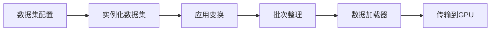

#### 3. 模型训练阶段

**前向传播流程**:
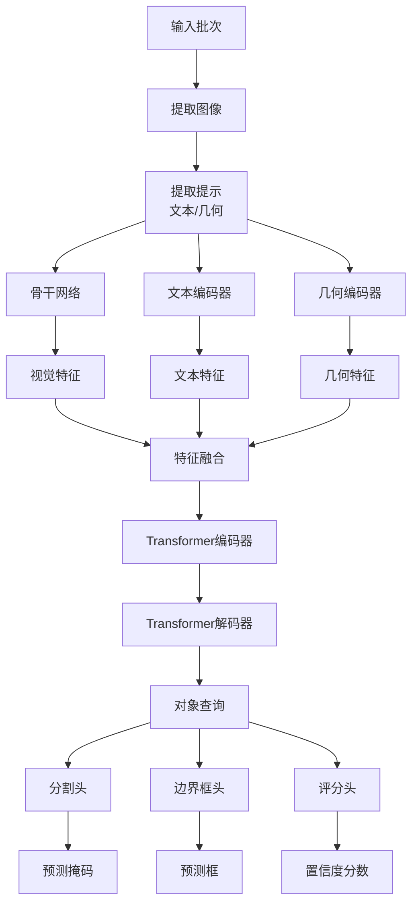

**损失计算**:
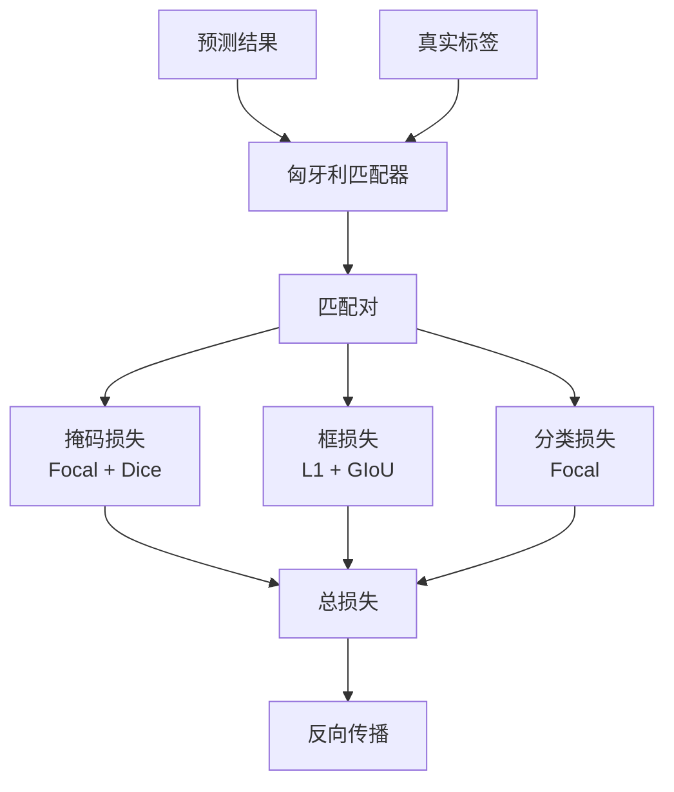

#### 4. 优化阶段
- **优化器**: AdamW（默认）
- **学习率调度**: 余弦退火或线性预热
- **梯度裁剪**: 可选，防止梯度爆炸
- **混合精度**: 支持FP16/BF16

---

## 推理流程

### 图像推理流程

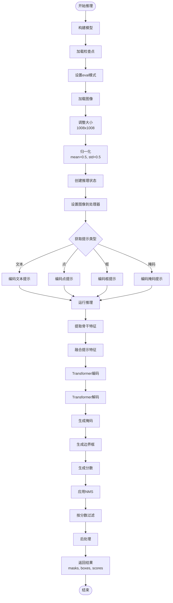

### 视频推理流程

```mermaid
flowchart TD
    Start([开始视频推理]) --> StartSession[开始会话]
    StartSession --> LoadVideo[加载视频]
    LoadVideo --> InitState[初始化推理状态]
    
    InitState --> AddPrompt{添加提示}
    AddPrompt --> SelectFrame[选择关键帧]
    SelectFrame --> PromptType{提示类型?}
    
    PromptType -->|文本| DetectInFrame[在帧中检测]
    PromptType -->|点/框| InteractiveSegment[交互式分割]
    
    DetectInFrame --> InitMasklets[初始化Masklets]
    InteractiveSegment --> InitMasklets
    
    InitMasklets --> PropagateLoop[传播循环]
    
    PropagateLoop --> LoadNextFrame[加载下一帧]
    LoadNextFrame --> ExtractFeatures[提取特征]
    ExtractFeatures --> RunDetector[运行检测器<br/>每N帧]
    
    RunDetector --> NewDetections{新检测?}
    NewDetections -->|是| AssociateDetections[关联检测]
    NewDetections -->|否| UseMemory[使用记忆]
    
    AssociateDetections --> UpdateMasklets[更新Masklets]
    UseMemory --> RunTracker[运行跟踪器]
    
    RunTracker --> QueryMemory[查询记忆库]
    QueryMemory --> CrossAttention[交叉注意力]
    CrossAttention --> PredictMasks[预测掩码]
    
    UpdateMasklets --> UpdateMemory[更新记忆]
    PredictMasks --> UpdateMemory
    
    UpdateMemory --> CheckOverlap{检查重叠}
    CheckOverlap -->|是| ResolveOverlap[解决重叠]
    CheckOverlap -->|否| OutputFrame[输出帧结果]
    ResolveOverlap --> OutputFrame
    
    OutputFrame --> CheckMore{更多帧?}
    CheckMore -->|是| PropagateLoop
    CheckMore -->|否| FinalizeResults[最终化结果]
    
    FinalizeResults --> CloseSession[关闭会话]
    CloseSession --> End([结束])
```

### 推理API使用

#### 图像推理示例
```python
from sam3.model_builder import build_sam3_image_model
from sam3.model.sam3_image_processor import Sam3Processor
from PIL import Image

# 构建模型
model = build_sam3_image_model()
processor = Sam3Processor(model)

# 加载图像
image = Image.open("image.jpg")
inference_state = processor.set_image(image)

# 文本提示
output = processor.set_text_prompt(
    state=inference_state, 
    prompt="a cat"
)

# 获取结果
masks = output["masks"]
boxes = output["boxes"]
scores = output["scores"]
```

#### 视频推理示例
```python
from sam3.model_builder import build_sam3_video_predictor

# 构建预测器
video_predictor = build_sam3_video_predictor()

# 开始会话
response = video_predictor.handle_request(
    request=dict(
        type="start_session",
        resource_path="video.mp4",
    )
)
session_id = response["session_id"]

# 添加文本提示
response = video_predictor.handle_request(
    request=dict(
        type="add_prompt",
        session_id=session_id,
        frame_index=0,
        text="a person",
    )
)

# 传播到整个视频
for frame_result in video_predictor.handle_stream_request(
    request=dict(
        type="propagate_in_video",
        session_id=session_id,
    )
):
    frame_idx = frame_result["frame_idx"]
    masks = frame_result["masks"]
    # 处理每帧结果
```

---

## 模型架构

### 整体架构图

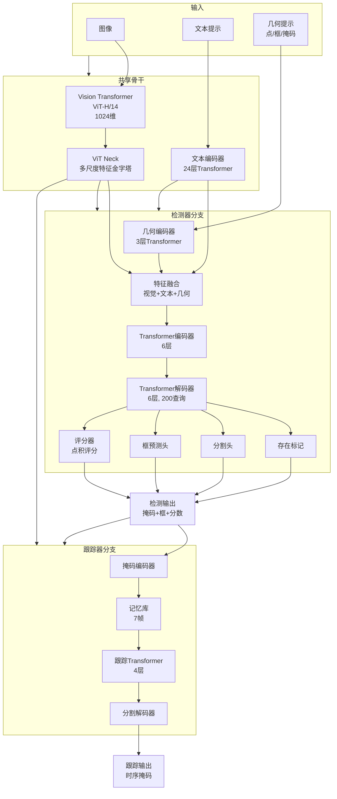

### 核心模块详解

#### 1. Vision Transformer骨干
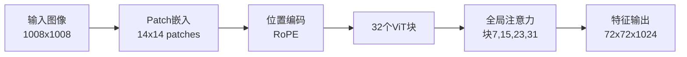

#### 2. Transformer编码器
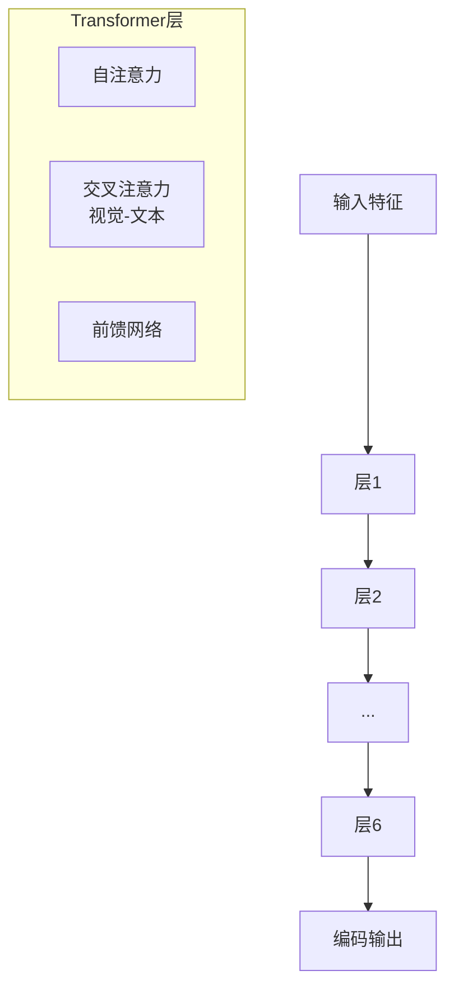

#### 3. Transformer解码器
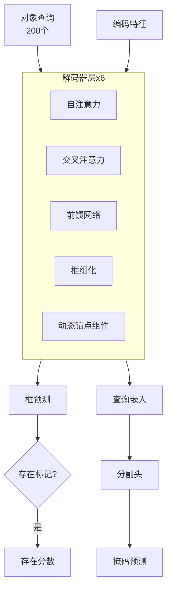

#### 4. 跟踪器架构
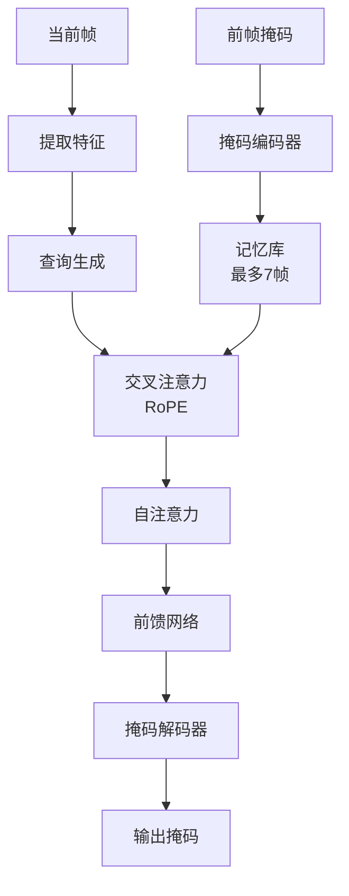

---

## 数据处理流程

### 图像数据处理

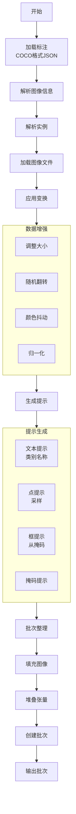

### 视频数据处理

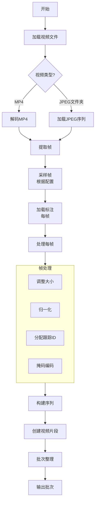

### 批次整理 (Collator)

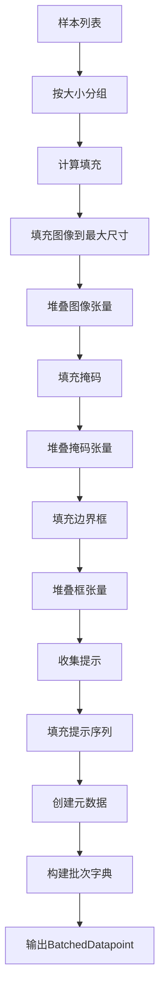

### 数据集类层次

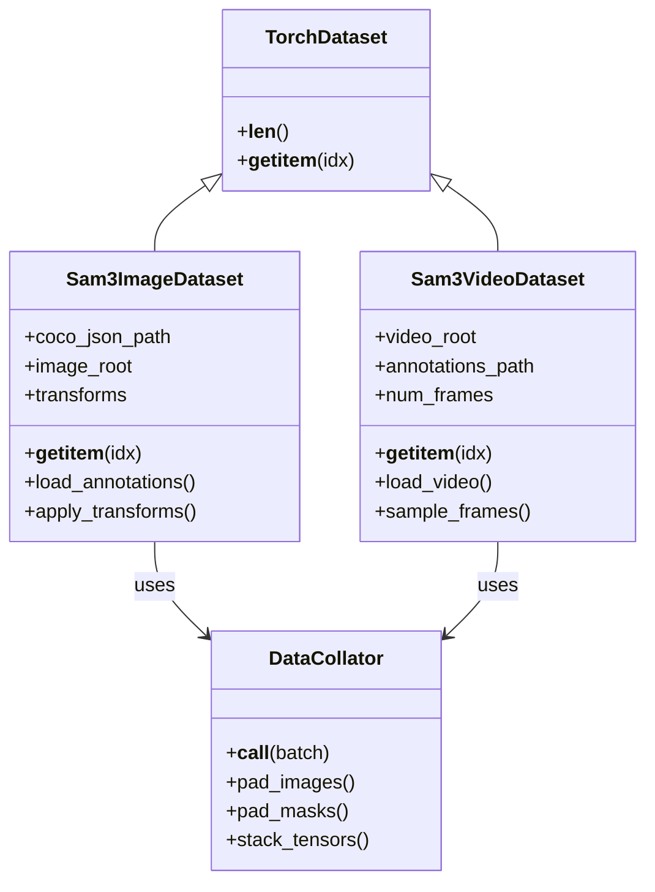

---

## 关键配置参数

### 训练配置
```yaml
# 模型配置
model:
  backbone:
    vision:
      img_size: 1008
      patch_size: 14
      embed_dim: 1024
    text:
      width: 1024
      heads: 16
      layers: 24
  
  transformer:
    encoder_layers: 6
    decoder_layers: 6
    num_queries: 200
    d_model: 256
  
  segmentation_head:
    hidden_dim: 256
    upsampling_stages: 3

# 训练配置
trainer:
  mode: train  # or val
  max_epochs: 12
  batch_size: 2
  num_workers: 4
  
  optim:
    lr: 1e-4
    weight_decay: 0.05
    amp: true
    gradient_clip: 0.1
  
  loss:
    mask_weight: 5.0
    box_weight: 2.0
    giou_weight: 2.0
    class_weight: 2.0

# 分布式配置
launcher:
  num_nodes: 1
  gpus_per_node: 8
  
submitit:
  use_cluster: true
  partition: "gpu"
  timeout_hour: 72
```

---

## 性能优化

### 训练优化技术
1. **混合精度训练**: FP16/BF16自动混合精度
2. **梯度累积**: 支持大批次训练
3. **激活检查点**: 减少内存使用
4. **分布式数据并行**: 多GPU/多节点训练
5. **编译优化**: PyTorch 2.x编译支持

### 推理优化技术
1. **批处理推理**: 并行处理多个样本
2. **模型编译**: TorchScript/Torch.compile
3. **TensorFloat-32**: Ampere GPU加速
4. **异步加载**: 帧异步加载（视频）
5. **记忆管理**: 跟踪器记忆库优化

---

## 总结

SAM3是一个复杂的多模态分割系统，其架构包括：

### 核心优势
1. **统一架构**: 同时支持图像和视频
2. **解耦设计**: 检测器和跟踪器独立优化
3. **开放词汇**: 支持大规模概念集
4. **多模态提示**: 灵活的提示方式

### 技术亮点
1. **Vision Transformer**: 强大的视觉特征提取
2. **双向Transformer**: 视觉-语言融合
3. **动态锚点**: 自适应对象查询
4. **存在标记**: 改进的文本提示区分
5. **记忆机制**: 高效的视频跟踪

### 应用场景
- 开放词汇图像分割
- 视频对象跟踪
- 交互式分割
- 多对象检测与分割
- 时序实例分割

---

## 参考资源

- [SAM3 Paper](https://ai.meta.com/research/publications/sam-3-segment-anything-with-concepts/)
- [GitHub Repository](https://github.com/facebookresearch/sam3)
- [Documentation](https://github.com/facebookresearch/sam3/blob/main/README.md)
- [Training Guide](https://github.com/facebookresearch/sam3/blob/main/README_TRAIN.md)
